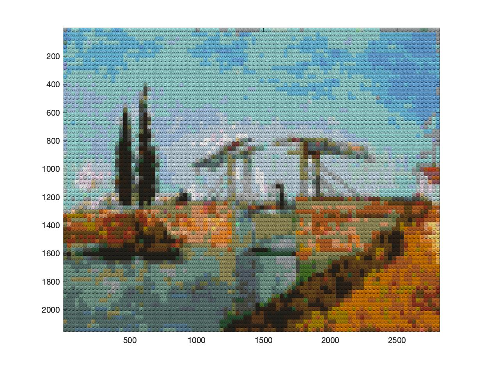
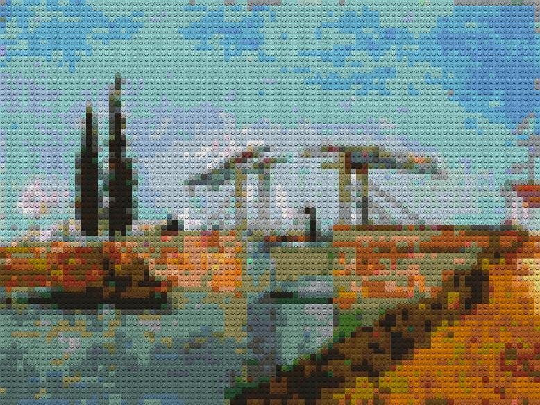
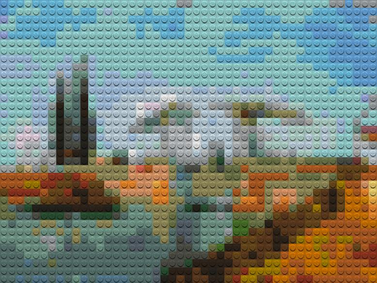
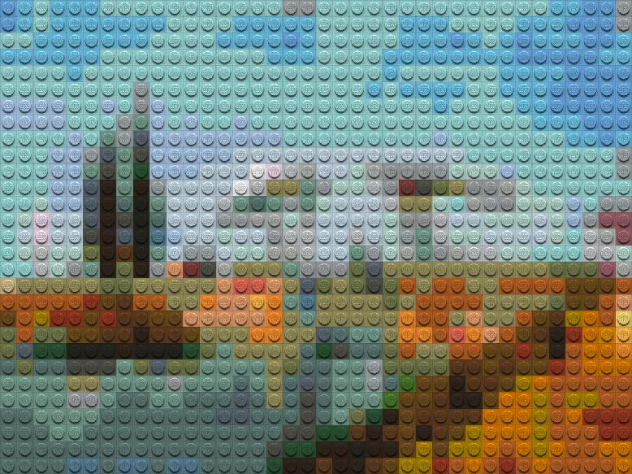
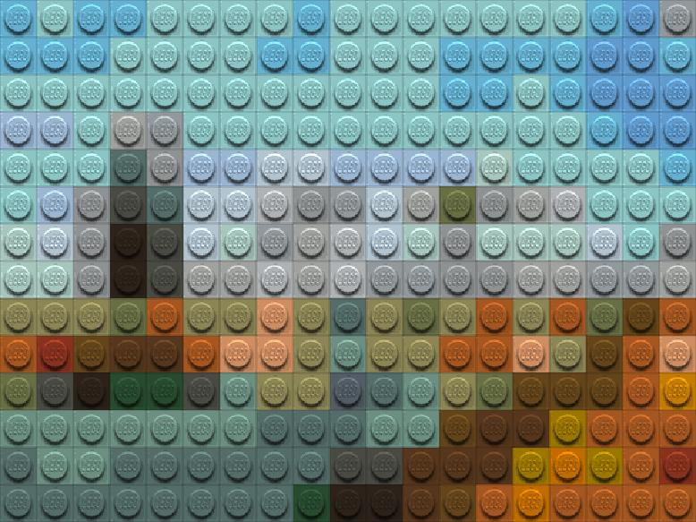
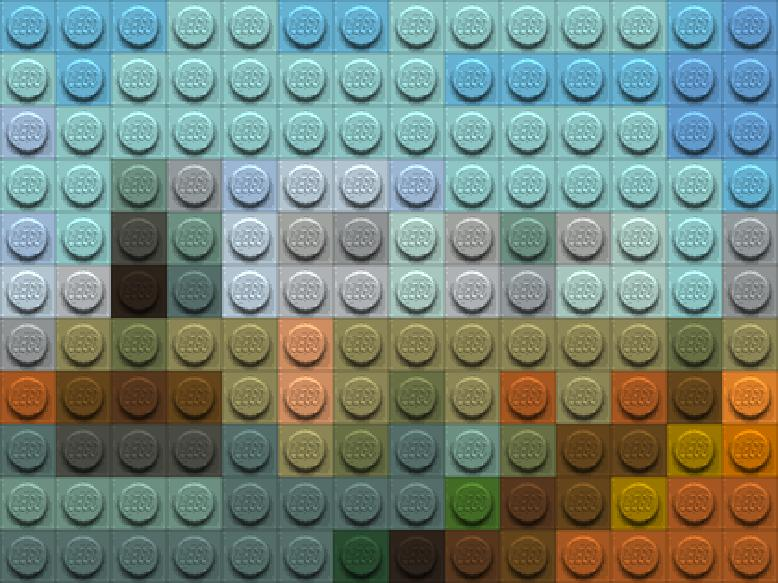

# Legofy
 Convert a normal image (or internet image) into  Lego-style, similar to https://github.com/JuanPotato/Legofy

 

<a name="HeLa"/>
<h2> Convert Images into Lego-Style  </h2>
</a>

This is a Matlab function that converts a normal RGB image into a Lego-style image. The input can be either an image that has been imported into Matlab or the url address of an image anywhere on the internet.

The conversion is super easy, you only need to download the function 

<pre class="codeinput"> Legofy.m </pre>

This function will take three arguments:

1) the image to convert, 
2) the scale to pixelise and,
3) if you want to display block by block. 

Arguments 2 and 3 are optional 
The image can be either an image or a URL

<h2> Examples </h2>

Read an image from wikimedia and convert (no extra parameters). The results is saved in dataOut and displayed with a second line of code:

<pre class="codeinput"> 
dataOut = Legofy('https://upload.wikimedia.org/wikipedia/commons/d/d5/Vincent_Van_Gogh_0014.jpg');
imagesc(dataOut)
 </pre>

 

Read an image from wikimedia and convert, select the scale and optional display. Notice that the second line (imagesc) is not needed:

<pre class="codeinput"> 
dataOut = Legofy('https://upload.wikimedia.org/wikipedia/commons/d/d5/Vincent_Van_Gogh_0014.jpg',0.02,1);
 </pre>

 

You can change the scale

<pre class="codeinput"> 
dataOut = Legofy('https://upload.wikimedia.org/wikipedia/commons/d/d5/Vincent_Van_Gogh_0014.jpg',0.02);
dataOut = Legofy('https://upload.wikimedia.org/wikipedia/commons/d/d5/Vincent_Van_Gogh_0014.jpg',0.01);
dataOut = Legofy('https://upload.wikimedia.org/wikipedia/commons/d/d5/Vincent_Van_Gogh_0014.jpg',0.003);
dataOut = Legofy('https://upload.wikimedia.org/wikipedia/commons/d/d5/Vincent_Van_Gogh_0014.jpg',0.004);
dataOut = Legofy('https://upload.wikimedia.org/wikipedia/commons/d/d5/Vincent_Van_Gogh_0014.jpg',0.008);
 </pre>

  
  
 

<h2> Video Guide </h2>

 

